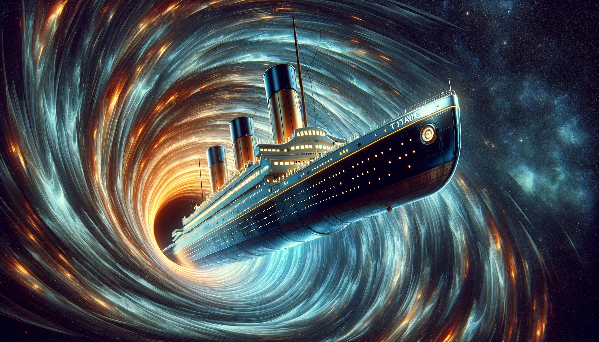

# Spaceship Titanic

## General info

This project is one of the Kaggle's Prediction Competitions. The goal of the project is to predict which passengers were transported into alternate dimension after spaceship collided with spacetime anomally. The final result is evaluated based on classification accuracy - the percentage of predicted labels that are correct. There are two possibilities - transported or not, so we will perform binary classification.

We have two datasets: labeled training data and test data on which we will make predictions. It is divided 67%/33% and contains almost 13000 record.

For further information visit Kaggle project's site:
[Spaceship Titanic](https://www.kaggle.com/competitions/spaceship-titanic)

## Project goals

In our work we will use Python3 in Jupyter Notebook. Main libraries are: Numpy, Pandas, Scikit Learn and Matplotlib.

Our main goal is, obviously, achieving the best possible accuracy of prediction. As, this is educational project my goals are: 
- conducting deepened EDA (Exploratory Data Analysis) including: handling missing values, finding hidden relationships beetween features and performing feature engineering,
- present the results of actions in a transparent graphical way, using mainly matplotlib and seaborn libraries,
- comparing different machine learning algorithms

## Final result

All side goals mentioned above were realized and best submission on Kaggle have accuracy score of 0.80640 which gave 185th position out of 2193 competitors (91 percentile) at the time of submiting.
